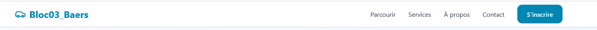
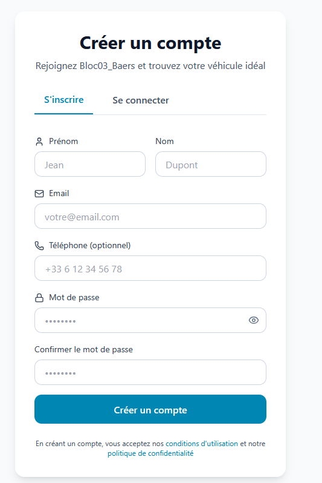

#  Bloc03_Baers - Plateforme de Location et Vente de Véhicules

# Installation Complète

Backend Flask (Terminal 1)

# À la racine du projet
cd backend

# Créer un environnement virtuel
python3 -m venv venv

# Activer l'environnement
venv\Scripts\activate  # Windows

# Installer les dépendances
pip install -r requirements.txt

# Démarrer le serveur Flask
python run.py

# La base de données est vide á la creation, il faudra créer un Admin et la remplir des données.

flask --app main create-admin       # Créer un admin
flask --app main seed-vehicles      # Ajouter véhicules de test

Frontend React (Terminal 2)

# À la racine du projet
cd frontend

# Installer les dépendances
pnpm install

# Démarrer le serveur de développement
pnpm run dev

# Endpoints API Disponibles

Véhicules
GET /api/vehicles - Lister tous les véhicules
POST /api/vehicles - Créer un véhicule (auth requise)
PUT /api/vehicles/:id - Modifier un véhicule
DELETE /api/vehicles/:id - Supprimer un véhicule

Authentification
POST /api/auth/login - Connexion
POST /api/auth/signup - Inscription

Applications
GET /api/applications - Lister les dossiers (admin)
POST /api/applications - Créer un dossier (client)
POST /api/applications/:id/approve - Approuver un dossier
POST /api/applications/:id/reject - Rejeter un dossier

# La navigation
Bloc03_Baers - Home
Parcourir - Selectionner véhicule est filtre
Services - Les différents service proposés
A propos - Valeur de la société
Contact - Email de contact
S´inscrire - Pour un utilisateur ou connexion

# Connexion:
Créer un compte - Pour la première fois pour s´inscrire
Se connecter - Pour se logger

# Worflow pour une reservaion ou achat

1. Client choisit véhicule
   ↓
2. Soumet dossier + permis + choix paiement
   ↓
3. Paie acompte 20 % (simulation)
   ↓
4. Paie le solde (simulation)
   ↓
5. Admin voit historique complet dans "Historique"
   ↓
6. Admin valide le dossier
   ↓
7. Client reçoit facture finale
   ↓
8. Statut passe à "Confirmé" ✓ (VERT)

# Notes:

alembic.ini & script.py.mako: Fichier de configuration d'Alembic généré par Flask-Migrate. Pour ce livrable, je ne m'en sers pas car j'utilise db.create_all() dans mon Application Factory pour générer automatiquement mon schéma SQL sur Azure PostgreSQL. Cependant, je l'ai conservé pour anticiper de futures versions où je devrai gérer des migrations de données complexes.